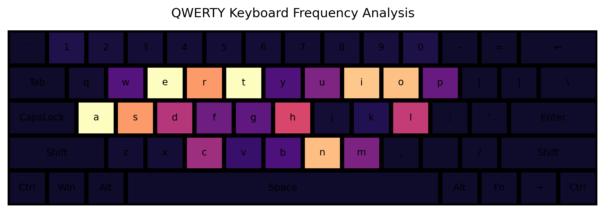

# Keyboard Frequency Analysis

Heatmaps for QWERTY and Persian standard keyboard layouts

Includes code for drawing a keyboard using matplotlib

Frequency data is available as csv files: `english_alphabet_freq.csv`, `persian_alphabet_freq.csv`

## Heatmaps:

## Keyboards:

